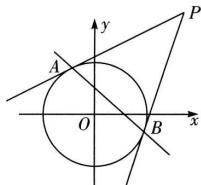

## 题型 6: 圆的切点弦问题

当点 $P(x_{0},y_{0})$ 在圆外时，方程 $x_{0}x+y_{0}y=r^{2}$ 或 $(x_{0}-a)(x-a)+(y_{0}-b)(y-b)=r^{2}$ 表示过点 P 做圆的两条切线, 切点为 A, B, 过
A, B 的直线方程（切点弦），如图.

证明方法1: 设圆上切点 $A(x_{1}, y_{1}), B(x_{2}, y_{2})$ ，由直线与圆的切线方程结论可知切线 MA, MB 的方程分别为 $x_{1}x + y_{1}y = 1, x_{2}x + y_{2}y = 1$ ，于是 $\left\{\begin{aligned}x_{1}x_{0} + y_{1}y_{0} &= 1 \\ x_{2}x_{0} + y_{2}y_{0} &= 1\end{aligned}\right.$ ，显然点 A, B 的坐标满足方程 $x_{0}x + y_{0}y = 1$ ，所以直线 AB 的方程为 $x_{0}x + y_{0}y = 1$ 。

证明方法 2:（公共弦法）连接 OA, OB，由于 PA, PB 为圆 O 的切线，则有 $OA \perp PA$ , $OB \perp PB$ ，则点 A、

B 在以 OP 为直径的圆上, 以 OP 为直径的圆的圆心为 $\left(\frac{x_{0}}{2}, \frac{y_{0}}{2}\right)$ , 半径 $r = \frac{1}{2} |OP| = \frac{\sqrt{x_{0}^{2} + y_{0}^{2}}}{2}$ ,
则其方程为 $(x-\frac{x_{0}}{2})^{2}+(y-\frac{y_{0}}{2})^{2}=\frac{x_{0}^{2}+y_{0}^{2}}{4}$ ，变形可得 $x^{2}+y^{2}-x_{0}x-y_{0}y=0$ 联立 $\left\{\begin{aligned}&x^{2}+y^{2}=1\\&x^{2}+y^{2}-x_{0}x-y_{0}y=0\end{aligned}\right.$ ，所以直线AB为两圆公共弦，两式相减可得直线AB: $x_{0}x+y_{0}y=1$ .

![[高中/课堂同步/题库/高中数学全练一本通/直线与圆/第七节 圆与圆的位置关系/重点题型专练/题型 6_ 圆的切点弦问题/questions/Q00007330.md]]
![[高中/课堂同步/题库/高中数学全练一本通/直线与圆/第七节 圆与圆的位置关系/重点题型专练/题型 6_ 圆的切点弦问题/questions/Q00007331.md]]
![[高中/课堂同步/题库/高中数学全练一本通/直线与圆/第七节 圆与圆的位置关系/重点题型专练/题型 6_ 圆的切点弦问题/questions/Q00007332.md]]
![[高中/课堂同步/题库/高中数学全练一本通/直线与圆/第七节 圆与圆的位置关系/重点题型专练/题型 6_ 圆的切点弦问题/questions/Q00007333.md]]
![[高中/课堂同步/题库/高中数学全练一本通/直线与圆/第七节 圆与圆的位置关系/重点题型专练/题型 6_ 圆的切点弦问题/questions/Q00007334.md]]
![[高中/课堂同步/题库/高中数学全练一本通/直线与圆/第七节 圆与圆的位置关系/重点题型专练/题型 6_ 圆的切点弦问题/questions/Q00007335.md]]
![[高中/课堂同步/题库/高中数学全练一本通/直线与圆/第七节 圆与圆的位置关系/重点题型专练/题型 6_ 圆的切点弦问题/questions/Q00007336.md]]
![[高中/课堂同步/题库/高中数学全练一本通/直线与圆/第七节 圆与圆的位置关系/重点题型专练/题型 6_ 圆的切点弦问题/questions/Q00007337.md]]
