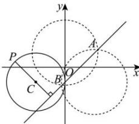

> [!faq]- 全练一本通解析
> **【答案】** D
>
> **【解析】**
> 解析: 圆 $C_{1}: x^{2} + y^{2} - 4x + 2y = 0$ ①与圆 $C_{2}: x^{2} + y^{2} - 2y - 4 = 0$ ②相交，两圆方程②-①化简得，x-y-1=0，即为相交弦AB的方程.
> 圆 $(x+2)^{2}+(y+1)^{2}=4$ 的圆心 $C(-2,-1)$ ,
> 则点 $C(-2,-1)$ 到直线 AB:x-y-1=0 的距离为 $d=\frac{|-2+1-1|}{\sqrt{2}}=\sqrt{2}$ ，因为 $d=\sqrt{2}<2$ ，直线与圆 C 相交，
> 则圆 $(x+2)^{2}+(y+1)^{2}=4$ 上的动点 P 到直线 AB 距离的最大值为 $d+r=\sqrt{2}+2$ ，故选：D.
> 
