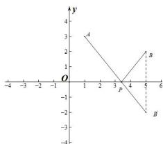

> [!faq]- 全练一本通解析
> **【答案】** B
>
> **【解析】**
> 解析： $\because$ 点 $A(1,3), B(5,2)$ ，点 $P$ 在 $x$ 轴上，点 $B$ 关系 $x$ 轴的对称点为 $B'(5,-2)$ ， $\therefore (|AP|+|PB|)_{min}= |AB'|=\sqrt{(5-1)^2+(-2-3)^2}=\sqrt{41}$ 。
> 故选:B.
> 
