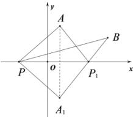

> [!faq]- 全练一本通解析
> **【答案】** $\sqrt{41}$
>
> **【解析】**
> 由题意，函数 $f(x)=\sqrt{(x-1)^{2}+9}+\sqrt{(x-5)^{2}+4}$ $=\sqrt{(x-1)^{2}+(0-3)^{2}}+\sqrt{(x-5)^{2}+(0-2)^{2}}$ 根据两点距离公式的几何意义得，函数 $f(x)$ 表示 $P(x,0)$ 到点 A(1,3), B(5,2) 距离之和，
> 如图所示，作出点 A(1,3) 关于 x 轴的对称点 $A_{1}(1,-3)$ ，
> 连接 $A_{1}B$ ，交 x 轴于点 $P_{1}$ ，连接 PA, PB, $PA_{1}, P_{1}A, P_{1}B$ 可得 $\left|PA\right|+\left|PB\right|=\left|PA_{1}\right|+\left|PB\right|\geq\left|A_{1}B\right|=\sqrt{(1-5)^{2}+(-3-2)^{2}}=\sqrt{41}$ 当且仅当点 P 与 $P_{1}$ 重合时，等号成立，
> ∴函数 $f(x)$ 的最小值为 $\sqrt{41}$ .
> 
