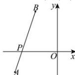

> [!faq]- 全练一本通解析
> **【答案】** $2\sqrt{10}$
>
> **【解析】**
> 因为 $f(x) = \sqrt{(x + 4)^2 + (0 + 2)^2} +\sqrt{(x + 2)^2 + (0 - 4)^2}$ 所以，函数 $f(x)$ 的几何意义为 $x$ 轴上的点 $P(x,0)$ 到点 $A(-4, - 2)$ 、 $B(-2,4)$ 的距离之和，即 $f(x) = |PA| + |PB|$ ，如下图所示：
> 
> 由图可知, 当点 A 、 P 、 B 三点共线时, $f(x)$ 取最小值,
> 且 $f(x)_{\min} = |AB| = \sqrt{(-4 + 2)^{2} + (-2 - 4)^{2}} = 2\sqrt{10}$ . 故答案为: $2\sqrt{10}$ .
