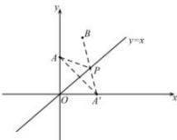

> [!faq]- 全练一本通解析
> **【答案】** B
>
> **【解析】**
> 解析：
> 
> 由两点之间距离公式可以得到 $\sqrt{x^{2}+(x-2)^{2}}$ 表示点 $P(x,x)$ 到 $A(0,2)$ 的距离， $\sqrt{(x-1)^{2}+(x-3)^{2}}$ 表示点 $P(x,x)$ 到 $B(1,3)$ 的距离，
> 所以代数式 $\sqrt{x^{2}+(x-2)^{2}}+\sqrt{(x-1)^{2}+(x-3)^{2}}$ 表示 PA+PB ，由图像可知 $P(x,x)$ 在 y=x 在运动，所以易得 $A(0,2)$ 关于 y=x 对称点为 $A'(2,0)$ ，连接 $A'B$ 交 y=x 于点 P，此时 $PA+PB$ 最小，最小值为 $\sqrt{(2-1)^{2}+(0-3)^{2}}=\sqrt{10}$ 。
>
> 故选 **B**.
