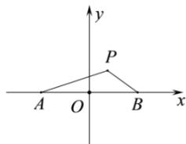

> [!faq]- 全练一本通解析
> **【解析】**
> 2
> 解析： $S=\sqrt{(x+1)^{2}+y^{2}}+\sqrt{(x-1)^{2}+y^{2}}$ 表示点 $P(x,y)$ 到点 $A(-1,0)$ 与点 $B(1,0)$ 的距离之和，
> 即 $S = |PA| + |PB|$ ，如图所示：
> 
> 由图象知： $S=\left|PA\right|+\left|PB\right|\geq\left|AB\right|=2$ ，当点P在线段AB上时，等号成立。所以S取得最小值为2。故答案为：2。
