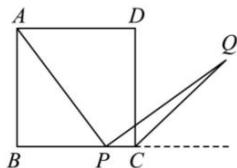

<!-- question-source:start -->
【32】正方形 ABCD 中, 在 BC 上任取一点 P（点 P 不与 B、C 重合）, 过点 P 作 AP 的垂线 PQ 交角 C 的外角平分线于点 Q. 用坐标法证明: $\left|AP\right|=\left|PQ\right|$ .

<!-- question-source:end -->

![[Q00007076A1]]
