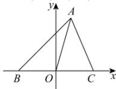

> [!faq]- 全练一本通解析
> **【答案】** 详见解析
>
> **【解析】**
> 解析：取 $BC$ 边所在直线为 $x$ 轴， $BC$ 的垂直平分线为 $y$ 轴，建立直角坐标系，如图
> 设 $B(-a,0)$ ， $C(a,0)$ ， $A(m,n)$ ，（其中 $a > 0$ ），
> 则 $\left|AB\right|^2 + \left|AC\right|^2 = (m + a)^2 + n^2 + (m - a)^2 + n^2 = 2(m^2 + n^2 + a^2)$ ， $\left|AO\right|^2 + \left|OC\right|^2 = m^2 + n^2 + a^2$ 所以 $\left|AB\right|^2 + \left|AC\right|^2 = 2(\left|AO\right|^2 + \left|OC\right|^2)$ ，即证.
> 
