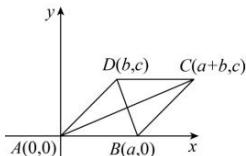

> [!faq]- 全练一本通解析
> **【解析】**
> 证明见解析
> 解析：如图所示，以顶点 $A$ 为坐标原点，以 $AB$ 所在直线为 $x$ 轴建立平面直角坐标系，则 $A(0,0)$ 。设 $B(a,0)$ ， $D(b,c)$ ，由平行四边形的性质得点 $C$ 的坐标为 $(a + b,c)$ 。
> 因为 $\left|AB\right|^2 = a^2$ ， $\left|CD\right|^2 = a^2$ ， $\left|AD\right|^2 = b^2 + c^2$ ， $\left|BC\right|^2 = b^2 + c^2$ ， $\left|AC\right|^2 = (a + b)^2 + c^2$ ， $\left|BD\right|^2 = (b - a)^2 + c^2$ 所以 $\left|AB\right|^2 + \left|CD\right|^2 + \left|AD\right|^2 + \left|BC\right|^2 = 2(a^2 + b^2 + c^2)$ ， $\left|AC\right|^2 + \left|BD\right|^2 = 2(a^2 + b^2 + c^2)$ ，所以 $\left|AB\right|^2 + \left|CD\right|^2 + \left|AD\right|^2 + \left|BC\right|^2 = \left|AC\right|^2 + \left|BD\right|^2$ ，
> 因此，平行四边形两条对角线的平方和等于四条边的平方和。
> 
