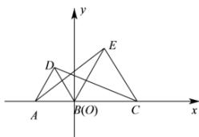

> [!faq]- 全练一本通解析
> **【解析】**
> 证明见解析.
> 解析：如图所示，以 B 点为坐标原点，取 AC 所在直线为 x 轴，建立平面直角坐标系 xOy，如图.
> 设 $\triangle ABD$ 和 $\triangle BCE$ 的边长分别为 a 和 c .
> 则 $A(-a,0)$ ， $C(c,0)$ ， $E\left(\frac{c}{2},\frac{\sqrt{3}c}{2}\right)$ ， $D\left(-\frac{a}{2},\frac{\sqrt{3}a}{2}\right)$ ，
> 由距离公式，得 $AE=\sqrt{\left(\frac{c}{2}+a\right)^{2}+\left(\frac{\sqrt{3}c}{2}-0\right)^{2}}=\sqrt{a^{2}+ac+c^{2}}$ $CD=\sqrt{\left(c+\frac{a}{2}\right)^{2}+\left(0-\frac{\sqrt{3}a}{2}\right)^{2}}=\sqrt{a^{2}+ac+c^{2}}$ 所以 AE=CD .
> 
