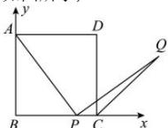

> [!faq]- 全练一本通解析
> **【解析】**
> 证明见解析
> 解析：以 B 为原点, 射线 BC、BA 分别为 x、y 轴的正半轴建立坐标系. 如图所示,
> 
> 设正方形边长为 $a$ ，则 $A(0, a)$ ， $C(a, 0)$ ，设点 $P$ 的坐标为 $(t, 0)(0 < t < a)$ 。 $k_{AP} = -\frac{a}{t}$ ， $l_{PQ}: y = \frac{t}{a}(x - t)$ ①， $l_{CQ}: y = x - a$ ②。联立①②可得 $Q(a + t, t)$ （或利用三角形全等求得点 $Q$ 坐标）。
> $\because |AP| = \sqrt{a^2 + t^2}, |PQ| = \sqrt{a^2 + t^2}, \therefore |AP| = |PQ|$ .
