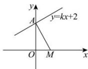

> [!faq]- 全练一本通解析
> **【解析】**
> $\sqrt{5}$ 解析：由题意得，直线 $y = kx + 2$ 过定点 $A(0, 2)$ ，则 $|MA| = \sqrt{5}$ ，如图所示，当直线 $y = kx + 2$ 与直线 $MA$ 垂直时，此时点 $M(1, 0)$ 到直线 $y = kx + 2$ 的距离最大值，且最大值为 $\sqrt{5}$ .
> 故答案为： $\sqrt{5}$ .
> 
