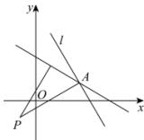

> [!faq]- 全练一本通解析
> **【解析】**
> $2\sqrt{5}$ 解析：直线 $l:(m+1)x-y-3m-2=0$ ，即 $x-y-2+m(x-3)=0$ ，
> 由 $\left\{\begin{aligned}&x-y-2=0\\&x-3=0\end{aligned}\right.$ ，解得 x=3，y=1，所以直线 l 恒过定点 A(3,1)，当直线 l 与直线 AP 垂直时，点 $P(-1,-1)$ 到直线 l 的距离的最大，
> 
> 最大值为 $|AP| = \sqrt{(3 + 1)^2 + (1 + 1)^2} = 2\sqrt{5}$ ，所以点 $P(-1, -1)$ 到直线 $l$ 的距离的最大值为 $2\sqrt{5}$ ，故答案为： $2\sqrt{5}$
