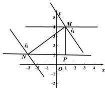

> [!faq]- 全练一本通解析
> **【解析】**
> 5
> 解析：根据题意画出图像, 如图所示:
> 
> 根据图像可得: 当 $l_{1} // l_{2}$ ，且 $l_{1} \perp MN$ ， $l_{2} \perp MN$ 时， $l_{1}$ 与 $l_{2}$ 之间的距离为 $|MN|$ ;
> 当 $l_{1} // l_{2}$ ，但是 $l_{1}$ 与 MN 不垂直， $l_{2}$ 与 MN 不垂直时，过 M 点向 $l_{2}$ 引垂线，垂足为 P，
> 则 $l_{1}$ 与 $l_{2}$ 之间的距离为 $|MP|$ ; 因为 $|MN| > |MP|$ ,
> 所以 $d_{\max} = \left|MN\right| = \sqrt{\left[1 - (-3)\right]^2 + (4 - 1)^2} = 5$ .
> 故答案为:5
