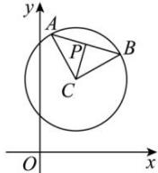

> [!faq]- 全练一本通解析
> **【答案】** B
>
> **【解析】**
> 解析: 圆 C 即 $(x-1)^{2}+(y-2)^{2}=2$ ，半径 $r=\sqrt{2}$ 因为 CA⊥CB，所以 AB= $\sqrt{2}r=2$ 又 P 是 AB 的中点，所以 CP= $\frac{1}{2}$ AB=1
> 所以点 P 的轨迹方程为 $(x-1)^{2}+(y-2)^{2}=1$ 故选:B
> 
