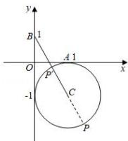

> [!faq]- 全练一本通解析
> **【答案】** D
>
> **【解析】**
> 解析：由 $\vec{a},\vec{b}$ 是单位向量，且 $\vec{a}\cdot\vec{b}=0$ ，则可设 $\vec{a}=(1,0)$ ， $\vec{b}=(0,1)$ ， $\vec{c}=(x,y)$ ；
> ∵ 向量 $\vec{c}$ 满足 $|\vec{c}-\vec{a}+\vec{b}|=1$ $\therefore|(x-1,y+1)|=1$ $\therefore\sqrt{(x-1)^{2}+(y+1)^{2}}=1$ 即 $(x-1)^{2}+(y+1)^{2}=1$ 它表示圆心为 $C(1,-1)$ ，半径为 r=1 的圆；
> 又 $|\vec{c}-\vec{b}|=(x,y-1)|=\sqrt{x^{2}+(y-1)^{2}}$ ，它表示圆 C 上的点到点 $B(0,1)$ 的距离，如图所示：
> 且 $|BC|=\sqrt{1^{2}+(-1-1)^{2}}=\sqrt{5}$ ∴ $\sqrt{5}-1\leqslant|PB|\leqslant\sqrt{5}+1$ 即 $|\vec{c}-\vec{b}|$ 的取值范围是 $[\sqrt{5}-1,\sqrt{5}+1]$ . 故选：D.
> 
