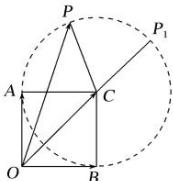
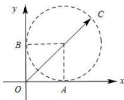

> [!faq]- 全练一本通解析
> **【解析】**
> $$
> \sqrt {2} + 1
> $$
> 解析: 法一: 由 $\vec{a} \cdot \vec{b} = 0$ , 得 $\vec{a} \perp \vec{b}$ .
> 如图所示, 分别作 $\overrightarrow{OA} = \overrightarrow{a}, \overrightarrow{OB} = \overrightarrow{b}$ ，作 $\overrightarrow{OC} = \overrightarrow{a} + \overrightarrow{b}$ ，
> 由于 $\vec{a},\vec{b}$ 是单位向量，则四边形 OACB 是边长为 1 的正方形，所以 $|\overrightarrow{OC}| = \sqrt{2}$
> 
> 作 $\overrightarrow{OP}=\vec{c}$ ，则 $|\vec{c}-\vec{a}-\vec{b}|=|\overrightarrow{OP}-\overrightarrow{OC}|=|\overrightarrow{CP}|=1$ ，
> 所以点 $P$ 在以 $C$ 为圆心，1为半径的圆上.
> 由图可知，当点 $O, C, P$ 三点共线且点 $P$ 在点 $P_{l}$ 处时， $|\overrightarrow{OP}|$ 取得最大值 $\sqrt{2} + 1$ ，故 $|\vec{c}|$ 的最大值是 $\sqrt{2} + 1$ ，故答案为： $\sqrt{2} + 1$ 法二：由 $\vec{a} \cdot \vec{b} = 0$ ，得 $\vec{a} \perp \vec{b}$ 建立如图所示的平面直角坐标系，则 $\overrightarrow{OA} = \vec{a} = (1,0), \overrightarrow{OB} = \vec{b} = (0,1)$
> 
> 设 $\vec{c} = \overrightarrow{OC} = (x,y)$ ，由 $|\vec{c} -\vec{a} -\vec{b}| = 1$ 得 $(x - 1)^2 +(y - 1)^2 = 1$ 所以点 $C$ 在以（1，1）为圆心，1为半径的圆上.所以 $|\vec{c}|_{\mathrm{max}} = \sqrt{2} +1$
