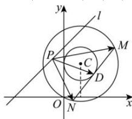

> [!faq]- 全练一本通解析
> **【答案】** A
>
> **【解析】**
> 解析：设线段MN的中点为D，圆： $C:x^{2} + y^{2} - 2x - 4y = 0$ 的圆心为 $C(1,2)$ ，半径为 $\sqrt{5}$ 则圆心 $C$ 到直线MN的距离为 $\sqrt{(\sqrt{5})^2 - \left(\frac{4}{2}\right)^2} = 1$ ，所以 $|CD| = 1$ 故点 $D$ 的轨迹是以 $C$ 为圆心，半径为1的圆，
> 设点 $D$ 的轨迹为圆 $D$ ，圆 $D$ 上的点到直线 $l$ 的最短距离为 $d = \frac{|1 - 2 + 3|}{\sqrt{2}} -1 = \sqrt{2} -1.$ 所以 $\left|\overrightarrow{PM} +\overrightarrow{PN}\right| = 2\left|\overrightarrow{PD}\right|\geq 2d = 2\sqrt{2} -2.$ 故选：A.
> 
