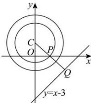

> [!faq]- 全练一本通解析
> **【答案】** B
>
> **【解析】**
> 解析: 圆 C 的标准方程: $x^{2} + (y - 1)^{2} = 4$ , 圆心 $C(0,1)$ , 半径为 2,
> 由 $\left|MN\right|=2\sqrt{2}$ ，可得 $\left|CP\right|=\sqrt{4-2}=\sqrt{2}$ 所以点 P 在以 $C(0,1)$ 为圆心， $\sqrt{2}$ 为半径的圆上，
> 又点 $C$ 到直线 $l: x - y - 3 = 0$ 的距离 $d = \frac{|0 - 1 - 3|}{\sqrt{2}} = 2\sqrt{2}$ ，所以 $|PQ|$ 的最小值为 $2\sqrt{2} - \sqrt{2} = \sqrt{2}$ 。故选：B.
> 
