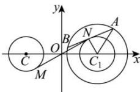

> [!faq]- 全练一本通解析
> **【答案】** B
>
> **【解析】**
> 解析: 圆 $C:(x+2)^{2}+y^{2}=1$ 的圆心为 $C(-2,0)$ ，半径为 r=1，
> 圆 $C_{1}:(x-2)^{2}+y^{2}=3$ 的圆心为 $C_{1}(2,0)$ ，半径为 $r_{1}=\sqrt{3}$ 如图所示，由弦长公式知 $\left|AB\right|=2\sqrt{r_{1}^{2}-\left|C_{1}N\right|^{2}}=2\sqrt{2}$ 解得 $\left|C_{1}N\right|=1$ ，所以点 N 在以 $C_{1}(2,0)$ 为圆心、1 为半径的圆上，
> 由图可知， $|MN|$ 的最小值为 $\left|CC_{1}\right|-r-1=4-1-1=2$ 。故选：B.
> 
