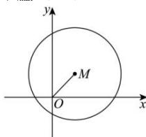

> [!faq]- 全练一本通解析
> **【答案】** B
>
> **【解析】**
> 解析: 已知 $\vec{a},\vec{b}$ 是两个单位向量, 且 $|\vec{a}+\vec{b}|=|\vec{a}-\vec{b}|$ ,
> 则 $\vec{a}^{2}+2\vec{a}\cdot\vec{b}+\vec{b}^{2}=\vec{a}^{2}-2\vec{a}\cdot\vec{b}+\vec{b}^{2}$ 则 $\vec{a}\cdot\vec{b}=0$ ，则 $\vec{a}\perp\vec{b}$ 设 $\vec{a},\vec{b}$ 分别是 x 轴与 y 轴正方向上的单位向量，
> 则 $\vec{a}=(1,0)$ , $\vec{b}=(0,1)$ , $\vec{a}+\vec{b}=(1,1)$ ,
> 设 $\vec{c}=(x,y)$ ，则 $\vec{c}-\vec{a}-\vec{b}=(x-1,y-1)$ 因为 $|\vec{c}-\vec{a}-\vec{b}|=\sqrt{(x-1)^{2}+(y-1)^{2}}=2$ 所以 $(x-1)^{2}+(y-1)^{2}=4$ 故 $\vec{c}=\overrightarrow{OC}$ 中，点 C 的轨迹是以 (1,1) 为圆心，r=2 为半径的圆，圆心 M(1,1) 到原点的距离为 $|OM|=\sqrt{1^{2}+1^{2}}=\sqrt{2}$ $\left|\vec{c}\right|_{\max}=\left|OM\right|+r=\sqrt{2}+2$ . 故选：B.
> 
