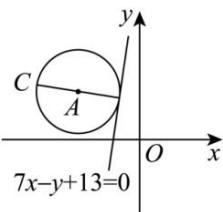

> [!faq]- 全练一本通解析
> **【答案】** $2\sqrt{2}$
>
> **【解析】**
> 设圆心 C 的坐标为 $(a,b)$ ，因为半径为 $\sqrt{2}$ 的圆 C 经过点 A(-3,2)，所以 $(a+3)^{2}+(b-2)^{2}=2$ ，所以点 C 的轨迹是以 A(-3,2) 为圆心， $\sqrt{2}$ 为半径的圆，
> 
> 故圆心 $C$ 到直线 $7x - y + 13 = 0$ 的距离的最大值为点 $A$ 到直线 $l$ 的距离加上半径 $\sqrt{2}$ 即 $\frac{|7\times(-3)-2+13|}{\sqrt{7^2 + (-1)^2}} +\sqrt{2} = 2\sqrt{2}$ 故答案为： $2\sqrt{2}$
