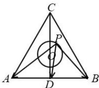

> [!faq]- 全练一本通解析
> **【答案】** A
>
> **【解析】**
> 解析:作出图像如下图所示,取 AB 的中点为 D, 则 $OD=4\sqrt{3}\times\frac{\sqrt{3}}{2}\times\frac{1}{3}=2$ , 因为 OP=1, 则 P 在以 O 为圆心, 以 1 为半径的圆上,
> 则 $\overrightarrow{PA} \cdot \overrightarrow{PB} = \frac{\left(\overrightarrow{PA} + \overrightarrow{PB}\right)^2 - \left(\overrightarrow{PA} - \overrightarrow{PB}\right)^2}{4} = \frac{\left(2\overrightarrow{PD}\right)^2 - \left(AB\right)^2}{4} = PD^2 - 12$ . 又 PD 为圆 O 上的点 P 到 D 的距离, 则 $PD_{\min} = 2 - 1 = 1$ ,
> ∴ $\overrightarrow{PA} \cdot \overrightarrow{PB}$ 的最小值为 -11. 故选:A.
> 
