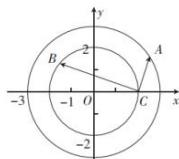

> [!faq]- 全练一本通解析
> **【答案】** 20
>
> **【解析】**
> 如图,记 $\vec{a}=\overrightarrow{OA}$ , $\vec{b}=\overrightarrow{OB}$ , $\vec{c}=\overrightarrow{OC}$ , 则 $(\vec{a}-\vec{c})\times(\vec{b}-\vec{c})=\overrightarrow{CA}\cdot\overrightarrow{CB}$
> 固定 C 点, 当 CB 为直径且 $\overrightarrow{CA}, \overrightarrow{CB}$ 同向时有最大值, 最大值为 $4 \times 5 = 20$
> 
