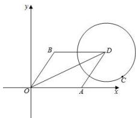

> [!faq]- 全练一本通解析
> **【解析】**
> $\left[\sqrt{6} -1,\sqrt{6} +1\right]$
> 解析： $\because \overrightarrow{OA}\cdot \overrightarrow{OB} = 1,\therefore \sqrt{2}\times \sqrt{2}\times \cos <  \overrightarrow{OA},\overrightarrow{OB} > = 1,\therefore \cos <  \overrightarrow{OA},\overrightarrow{OB} > = \frac{1}{2}$
> 
> $\therefore OA, OB$ 的夹角为 $\frac{\pi}{3}$ .
> 设 $\overrightarrow{OA} = (\sqrt{2}, 0), \overrightarrow{OB} = \left( \frac{\sqrt{2}}{2}, \frac{\sqrt{6}}{2} \right)$ , 设 $\overrightarrow{OA} + \overrightarrow{OB} = \overrightarrow{OD}$ , 则 $\overrightarrow{OD} = \overrightarrow{OA} + \overrightarrow{OB} = \left( \frac{3\sqrt{2}}{2}, \frac{\sqrt{6}}{2} \right)$ , $\therefore |\overrightarrow{OD}| = \sqrt{6}, \therefore |\overrightarrow{OA} + \overrightarrow{CB}| = 1, \therefore |\overrightarrow{OA} + \overrightarrow{OB} - \overrightarrow{OC}| = 1$ , 即 $|\overrightarrow{OD} - \overrightarrow{OC}| = |\overrightarrow{CD}| = 1, \therefore C$ 在以 D 为圆心, 以 1 为半径的圆上, $\therefore |\overrightarrow{OC}|$ 的最小值为 $\sqrt{6} - 1, |\overrightarrow{OC}|$ 的最大值是 $\sqrt{6} + 1$ 故答案为: $[\sqrt{6} - 1, \sqrt{6} + 1]$
