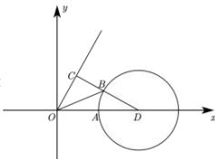

> [!faq]- 全练一本通解析
> **【答案】** D
>
> **【解析】**
> 解析：
> 
> 建立平面直角坐标系 $xOy$ ，设 $\vec{a} = \overrightarrow{OA}, \vec{b} = \overrightarrow{OB}, \vec{c} = \overrightarrow{OC}$ ，由 $\left|\vec{a}\right| = 1, \cos \left\langle \vec{a}, \vec{c} \right\rangle = \frac{1}{2}$ ，不妨设 $\vec{a} = \overrightarrow{OA} = (1,0)$ ，又 $\left\langle \vec{a}, \vec{c} \right\rangle = \frac{\pi}{3}$ ，不妨设 $C$ 在直线 $y = \sqrt{3} x (x > 0)$ 上，又 $\vec{b}^2 - 4\vec{a} \cdot \vec{b} + 3 = 0$ 可得 $\vec{b}^2 - 4\vec{a} \cdot \vec{b} + 4 = 1$ ，即 $\vec{b}^2 - 4\vec{a} \cdot \vec{b} + 4\vec{a}^2 = 1$ ，则 $(\vec{b} - 2\vec{a})^2 = 1$ ，设 $D(2,0)$ ，则 $\overrightarrow{OD} = 2\overrightarrow{OA} = 2\vec{a}$ ，则 $(\overrightarrow{OB} - \overrightarrow{OD})^2 = 1$ ，即 $\overrightarrow{DB}^2 = 1$ ，则 $B$ 在以 $D(2,0)$ 为圆心，1为半径的圆上；又 $\left|\vec{b} - \vec{c}\right| = \left|\overrightarrow{OB} - \overrightarrow{OC}\right| = \left|\overrightarrow{CB}\right|$ ，则 $\frac{n(n+1)}{2} < (a_1 + a_2 + a_3 + \cdots + a_n) < (2^n - 1)$ 的最小值等价于 $\left|\overrightarrow{CB}\right|$ 的最小值，即以 $D(2,0)$ 为圆心，1为半径的圆上一点到直线 $y = \sqrt{3} x (x > 0)$ 上一点距离的最小值，即圆心到直线的距离减去半径，即 $\frac{2\sqrt{3}}{\sqrt{1+3}} - 1 = \sqrt{3} - 1$ ，则 $\left|\vec{b} - \vec{c}\right|$ 的最小值是 $\sqrt{3} - 1$ 。故选：D.
