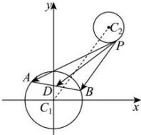

> [!faq]- 全练一本通解析
> **【答案】** D
>
> **【解析】**
> 解析: 设 AB 中点为 D,
> 则由 $\left|AB\right|=4\sqrt{2}$ 得 $\left|C_{1}D\right|=\sqrt{3-2}=1$ ,
> 即 D 点的轨迹方程为 $x^{2}+y^{2}=1$ . $\left|\overrightarrow{PA}+\overrightarrow{PB}\right|=2\left|\overrightarrow{PD}\right|$ 由于 P 点在圆 $C_{2}:(x-3)^{2}+(y-4)^{2}=1$ 上，
> 所以 $\left|C_{1}C_{2}\right|=5$ 所以 $\left|C_{1}C_{2}\right|-1-1\leq\left|PD\right|\leq\left|C_{1}C_{2}\right|+1+1$ 即 $\left|\overrightarrow{PD}\right|\in\left[3,7\right]$ 所以 $\left|\overrightarrow{PA}+\overrightarrow{PB}\right|=2\left|\overrightarrow{PD}\right|\in\left[6,14\right]$ .
> 故选:D.
> 
