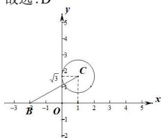

> [!faq]- 全练一本通解析
> **【答案】** D
>
> **【解析】**
> 解析：由题意知， $\left|\vec{a}\right|=\left|\vec{b}\right|=2,\left\langle\vec{a},\vec{b}\right\rangle=60^{\circ}$ ，则 $\vec{a}^{2}=4$ ，
> 由 $\vec{c}^{2}-2\vec{a}\cdot\vec{c}+3=0$ 可得 $\vec{c}^{2}-2\vec{a}\cdot\vec{c}+\vec{a}^{2}=1$ ，即 $(\vec{a}-\vec{c})^{2}=1$ ，
> 设 $\vec{c}=(x,y),\vec{a}=(1,\sqrt{3}),\vec{b}=(2,0)$ ，
> 则 $\vec{a}-\vec{c}=(1-x,\sqrt{3}-y),\vec{b}+\vec{c}=(x+2,y)$ 所以 $(x-1)^{2}+(y-\sqrt{3})^{2}=1,\left|\vec{b}+\vec{c}\right|=\sqrt{(x+2)+y^{2}}$ 所以 $\vec{c}=(x,y)$ 表示以 $C(1,\sqrt{3})$ ，半径为 1 的圆， $\left|\vec{b}+\vec{c}\right|=\sqrt{(x+2)+y^{2}}$ 表示圆 C 上的点 $(x,y)$ 到定点 B (-2,0) 的距离，
> 而 $\left|\vec{b}+\vec{c}\right|$ 的最小值即为圆心到定点 B (-2,0) 的距离减去半径，如图所示，
> 又 $BC=\sqrt{(1+2)^{2}+(\sqrt{3}-0)^{2}}=2\sqrt{3}$ ，所以 $\left|\vec{b}+\vec{c}\right|_{\min}=BC-1=2\sqrt{3}-1$ 。
> 故选:D
> 
