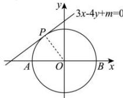

> [!faq]- 全练一本通解析
> **【答案】** D
>
> **【解析】**
> 解析: 根据题意可知，以 AP 为直径的圆与直线 $3x - 4y + m = 0 (m > 0)$ ，相
> 解析:根据题意可知,以 AB 为直径的圆与直线 $3x - 4y + m = 0 (m > 0)$ 相切,如下图所示:
> 
> 所以圆心 $(0,0)$ 到直线的距离等于半径，即 $d = \frac{|m|}{\sqrt{3^2 + (-4)^2}} = 2$ ，解得 $m = \pm 10$ ，又 $m > 0$ ，所以 $m = 10$ .故选：D
