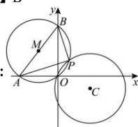

> [!faq]- 全练一本通解析
> **【答案】** B
>
> **【解析】**
> 解析：
> 
> 如图, 由 $PA \perp PB$ 可知点 $P$ 的轨迹是以 $AB$ 为直径的圆, 设为圆 $M$ , 因 $A(-6,0), B(0,8)$ , 故圆 $M: (x + 3)^2 + (y - 4)^2 = 25$ . 依题意知圆 $M$ 与圆 $C$ 必至少有一个公共点. 因 $C(5,-2), M(-3,4)$ , 则 $|CM| = \sqrt{(5 + 3)^2 + (-2 - 4)^2} = 10$ , 由 $|r - 5| \leq |CM| \leq 5 + r$ , 解得: $5 \leq r \leq 15$ . 故选: B.
