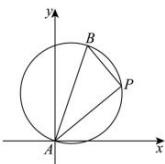

> [!faq]- 全练一本通解析
> **【答案】** B
>
> **【解析】**
> 解析: $\because 1 \times m - m \times 1 = 0$ $\therefore PA \perp PB$ , 点 $P$ 的轨迹是以 $AB$ 为直径的圆.
> 
> 所以 $\left|PA\right|^{2}+\left|PB\right|^{2}=\left|AB\right|^{2}=10$ 所以 $0 \leq 2 \left| PA \right| \cdot \left| PB \right| \leq \left| PA \right|^{2} + \left| PB \right|^{2} = 10$ 所以 $\left(\left| PA \right| + \left| PB \right|\right)^{2} = \left| PA \right|^{2} + \left| PB \right|^{2} + 2 \left| PA \right| \cdot \left| PB \right| \in [10, 20]$ ，
> 所以 $\sqrt{10} \leq \left| PA \right| + \left| PB \right| \leq 2\sqrt{5}$ . 故选：B
