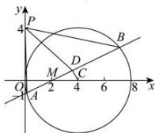

> [!faq]- 全练一本通解析
> **【答案】** ABC
>
> **【解析】**
> 解析:由题意知， $C(4,0)$ ，圆 C 的半径为 4，设 AB 的中点 $D(x,y)$ ，则 $MD \perp CD$ ，即 $\overrightarrow{MD} \cdot \overrightarrow{CD} = 0$ ，
> 又 $\overrightarrow{MD} = (x - 2, y), \overrightarrow{CD} = (x - 4, y)$ ，所以 $(x - 2)(x - 4) + y^{2} = 0$ ，
> 即点 D 的轨迹方程为 $E:(x-3)^{2}+y^{2}=1$ ，圆心 $E(3,0)$ ，半径为 1，
> 所以 $|PD|$ 的最大值为 $|PE| + 1 = \sqrt{3^{2} + 4^{2}} + 1 = 6$ ，最小值为 $|PE|-1=\sqrt{3^{2}+4^{2}}-1=4.$ 因为 $\left|\overrightarrow{PA}+\overrightarrow{PB}\right|=2\left|\overrightarrow{PD}\right|$ ,
> 所以 $\left|\overrightarrow{PA}+\overrightarrow{PB}\right|\in[8,12]$ .
> 故 $|\overrightarrow{PA}+\overrightarrow{PB}|$ 的值可能为 $8, 8\sqrt{2}, 12, 不可能为 12\sqrt{2}$ . 故选: ABC.
> 
