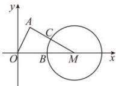

> [!faq]- 全练一本通解析
> **【答案】** D
>
> **【解析】**
> 解析: 因为 $\left|\vec{a}\right|=\left|\vec{b}\right|=\vec{a}\cdot\vec{b}=2$ ,
> 所以 $\cos\left\langle\vec{a},\vec{b}\right\rangle=\frac{\vec{a}\cdot\vec{b}}{\left|\vec{a}\right|\cdot\left|\vec{b}\right|}=\frac{1}{2}$ ，又 $\left\langle\vec{a},\vec{b}\right\rangle\in\left[0,\pi\right]$ ，
> 所以 $\left\langle\vec{a},\vec{b}\right\rangle=\frac{\pi}{3}$
> 如图所示:
> 
> 不妨设 $A(1, \sqrt{3}), B(2, 0), C(x, y)$ ，
> 则 $\vec{a} = \overrightarrow{OA} = (1, \sqrt{3}), \vec{b} = \overrightarrow{OB} = (2, 0), \vec{c} = \overrightarrow{OC} = (x, y)$ ，
> 所以 $\vec{b} - \vec{c} = (2 - x, -y), 3\vec{b} - \vec{c} = (6 - x, -y)$ ，
> 因为 $(\vec{b} - \vec{c}) \cdot (3\vec{b} - \vec{c}) = 0$ ，
> 所以 $(2 - x)(6 - x) + y^2 = 0$ ，即 $(x - 4)^2 + y^2 = 4$ ，
> 表示点 $C$ 在以 $M(4, 0)$ 为圆心，以 2 为半径的圆上，
> 所以 $|\vec{c} - \vec{a}|$ 最小值为 $|AM| - r = \sqrt{(1 - 4)^2 + (\sqrt{3})^2} - 2 = 2\sqrt{3} - 2$ ，
>
> 故选 **D**
