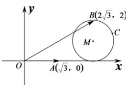

> [!faq]- 全练一本通解析
> **【解析】**
> [1,3]
> 解析：由题可知： $|\vec{a}| \cos \theta = \frac{3}{2} \Rightarrow \cos \theta = \frac{\sqrt{3}}{2}$ ，
> 所以 $\theta = \frac{\pi}{6}$ . 以 $O$ 为坐标原点建系如图，
> 
> 则 $A\left(\sqrt{3},0\right)$ ， $B\left(2\sqrt{3},2\right)$ ，设 $\vec{c} = (x,y)$
> $\left(x-2\sqrt{3},y\right)\cdot\left(x-2\sqrt{3},y-2\right)=0$ 则 $\left(x-2\sqrt{3}\right)^{2}+\left(y-1\right)^{2}=1$ ，圆心 $M\left(2\sqrt{3},1\right),r=1$ $\because \left|\vec{c}-\vec{a}\right|=\sqrt{\left(x-\sqrt{3}\right)^{2}+y^{2}}$ 表示 C 到 A 的距离，
> 所以 $d=\left|AM\right|=\sqrt{\left(\sqrt{3}\right)^{2}+1^{2}}=2$ 故 $\left|\vec{c}-\vec{a}\right|\in\left[d-r,d+r\right]=\left[1,3\right]$ . 故答案为： $[1,3]$
