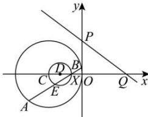

> [!faq]- 全练一本通解析
> **【答案】** D
>
> **【解析】**
> 解析: 因为圆 $C:(x+3)^{2}+y^{2}=9$ ，所以 $C(-3,0)$ ，
> 因为 $l_{1}: mx + y + m = 0$ ，即 $m(x+1) + y = 0$ ，所以 $l_{1}$ 过定点 $X(-1,0)$ ，直线 $l_{2}: 3x + 4y - 12 = 0$ ，令 x = 0，则 y = 3；令 y = 0，则 x = 4，
> 则 $P(0,3)$ , $Q(4,0)$ , $|PQ|=5$ , 作出图象如图所示:
> 
> 因为 E 为 AB 中点, 所以 $CE \perp XE$ , 所以点 E 的轨迹为以 $D(-2,0)$ 为圆心, 1 为半径的圆,
> 所以点 E 到 PQ 的最大距离为 $d=\frac{|-6-12|}{\sqrt{3^{2}+4^{2}}}+1=\frac{23}{5}$ ,
> 所以 $\triangle EPQ$ 面积的最大值为 $\frac{1}{2}\cdot|PQ|\cdot d=\frac{23}{2}$ .
>
> 故选 **D**.
