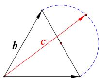

> [!faq]- 全练一本通解析
> **【答案】** 7
>
> **【解析】**
> 由 $\left|\vec{a}\right|=\left|\vec{b}\right|=\vec{a}\cdot\vec{b}=2$ ，可得 $\left\langle\vec{a},\vec{b}\right\rangle=60^{\circ}$ ，得到等边三角形，
> 由 $(\vec{a}-\vec{c})\cdot(\vec{b}-\vec{c})=0$ ，想到构造圆
> 如图, 以等边三角形的第三边为直径构造一个圆, 若向量 $\vec{c}$ 的起点向量 $\vec{a}, \vec{b}$ 相同, 则 $\vec{c}$ 的终点在圆上, $\vec{a}\cdot(\vec{b}+\vec{c})=2+\vec{a}\cdot\vec{c}$ , 由投影可知 $\vec{a}\cdot\vec{c}\leq2\times\frac{5}{2}=5$ , 故 $\vec{a}\cdot(\vec{b}+\vec{c})\leq2+5=7$
> 
