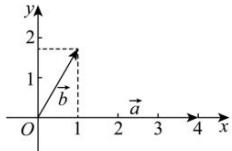

> [!faq]- 全练一本通解析
> **【答案】** C
>
> **【解析】**
> 解析:如图,建立平面直角坐标系,依题意令 $\vec{a}=(4,0)$ , $\vec{b}=(1,\sqrt{3})$ , $\vec{c}=(x,y)$ , $\vec{a}-\vec{c}=(4-x,-y),2\vec{b}-\vec{c}=(2-x,2\sqrt{3}-y)$ ,
> 因为 $(\vec{a}-\vec{c})\cdot(2\vec{b}-\vec{c})=(4-x)(2-x)+(-y)(2\sqrt{3}-y)=0$ 所以 $x^{2}+y^{2}-6x-2\sqrt{3}y+8=0$ ，即 $(x-3)^{2}+(y-\sqrt{3})^{2}=4$ ， $(x-3)^{2}\leq4$ ，则 $1\leq x\leq5$ 则 $\vec{a}\cdot\vec{c}=4x\geq4$ ，则 $\vec{a}\cdot\vec{c}$ 的最小值为 4. 故选：C.
> 
