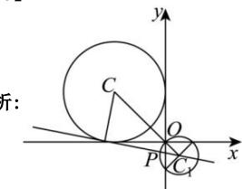

> [!faq]- 全练一本通解析
> **【答案】** C
>
> **【解析】**
> 
> 直线 $nx + my - n = 0$ 即直线 $n(x - 1) + my = 0$ ，过定点 $M(1,0)$
> 直线 $mx - ny - n = 0$ 即直线 $mx - n(y + 1) = 0$ ，过定点 $N(0, - 1)$ 又由斜率关系可得两直线垂直，所以交点 $P$ 的轨迹是以 $MN$ 为直径的圆，即轨迹方程为 $C_1: \left(x - \frac{1}{2}\right)^2 + \left(y + \frac{1}{2}\right)^2 = \frac{1}{2}$ ，圆心 $C_1\left(\frac{1}{2}, - \frac{1}{2}\right)$ ，因为 $Q$ 是圆 $C$ 上一点，且 $PQ$ 与 $C$ 相切，所以问题转化为圆 $C_1$ 上任意一点 $P$ 作直线与圆 $C$ 相切，求切线 $|PQ|$ 的范围.设设圆 $C$ 的半径为 $R = 2$ ，因为圆 $C$ 的圆心 $(-2, 2)$ ，半径为定值，当 $|PC|$ 取得最小值和最大值时，切线 $|PQ|$ 取得最小值和最大值， $|CC_1| = \sqrt{\left(\frac{1}{2} + 2\right)^2 + \left(-\frac{1}{2} - 2\right)^2} = \frac{5\sqrt{2}}{2}$ ，又因为 $|CC_1| - \frac{\sqrt{2}}{2} \leq |PC| \leq |CC_1| + \frac{\sqrt{2}}{2}$ ，即 $\frac{5\sqrt{2}}{2} - \frac{\sqrt{2}}{2} \leq |PC| \leq \frac{5\sqrt{2}}{2} + \frac{\sqrt{2}}{2}$ ，即 $2\sqrt{2} \leq |PC| \leq 3\sqrt{2}$ ，所以 $\sqrt{|PC|_{\min}^2 - R^2} \leq |PQ| \leq \sqrt{|PC|_{\max}^2 - R^2}$ ，即 $2 \leq |PQ| \leq \sqrt{14}$ ，故选：C.
