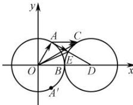

> [!faq]- 全练一本通解析
> **【答案】** A
>
> **【解析】**
> 解析:由题意设 $\vec{b}=\overrightarrow{OB}=(1,0)$ ， $\vec{a}=\overrightarrow{OA}=(m,n)$ ， $\vec{c}=\overrightarrow{OC}=(x,y)$ ，
> 则 $(m,n)\cdot(m-1,n)=\frac{1}{2}$ ，即 $(m-\frac{1}{2})^{2}+n^{2}=\frac{3}{4}$ ，且 $m^{2}+n^{2}=1$ ，
> 解得 $m=\frac{1}{2}$ ， $n=\frac{\sqrt{3}}{2}$ 或 $n=-\frac{\sqrt{3}}{2}$ .
> 由 $(\vec{b}-\vec{c})\perp(3\vec{b}-\vec{c})$ 可得 $(\vec{b}-\vec{c})\cdot(3\vec{b}-\vec{c})=0$ ，即 $(1-x,-y)\cdot(3-x,-y)=(x-2)^{2}+y^{2}-1=0$ 则 $(x-2)^{2}+y^{2}=1$ ，即 $\vec{c}$ 的终点C在以D(2,0)为圆心，1为半径的圆上，
> 
> $$
> \left| \vec {a} - \vec {c} \right| = \left| \overrightarrow {C A} \right|
> $$
> 故 $\left|a-c\right|=\left|CA\right|$ .
> 由圆的对称性, 不妨令 $n=\frac{\sqrt{3}}{2}$ ，即 $\vec{a}=(\frac{1}{2},\frac{\sqrt{3}}{2})$ 如图, 连接 AD, 交圆于 E,
> 由点与圆的位置关系可
> 知， $\left|\overrightarrow{CA}\right|\geq\left|\overrightarrow{AE}\right|=\left|AD\right|-\left|DE\right|=\sqrt{\left(\frac{1}{2}-2\right)^{2}+\left(\frac{\sqrt{3}}{2}\right)^{2}}-1=\sqrt{3}-1$ . 故选: A.
