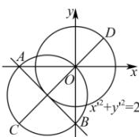

> [!faq]- 全练一本通解析
> **【答案】** B
>
> **【解析】**
> 解析: 由 $y=kx+m(km\neq0)$ ，得 $A(-\frac{m}{k},0), B(0,m)$ ，由 $\left|AB\right|=2\sqrt{2}$ ，得 $(- \frac{m}{k})^{2} + m^{2} = 8$ 由 $CA \perp CB$ ，得 $\overrightarrow{AC} \cdot \overrightarrow{BC} = 0$ ，设 $C(x, y)$ ，则 $(x + \frac{m}{k}, y) \cdot (x, y - m) = 0$ ，
> 即 $(x + \frac{m}{2k})^{2} + (y - \frac{m}{2})^{2} = \frac{m^{2}}{4k^{2}} + \frac{m^{2}}{4} = 2$ ，因此点 C 的轨迹为一动圆，
> 设该动圆圆心为 $(x', y')$ ，即有 $x' = -\frac{m}{2k}, y' = \frac{m}{2}$ ，则 $\frac{m}{k} = -2x', m = 2y'$ 代入 $(- \frac{m}{k})^{2} + m^{2} = 8$ 整理得： $x'^{2}+y'^{2}=2$ ，即 C 轨迹的圆心在圆 $x'^{2}+y'^{2}=2$ 上（除此圆与坐标轴的交点外），
> 点 $D(1,1)$ 与圆 $x'^{2}+y'^{2}=2$ 上点 $(-1,-1)$ 连线的距离加上圆 C 的半径即为点 C 到点 $D(1,1)$ 的距离的最大值，
> 所以最大值为 $\sqrt{\left[1-(-1)\right]^{2}+\left[1-(-1)\right]^{2}}+\sqrt{2}=3\sqrt{2}$ . 故选: B
> 
