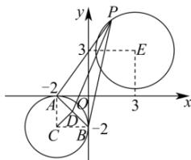

> [!faq]- 全练一本通解析
> **【答案】** B
>
> **【解析】**
> 【4】B
> 解析: 因为直线 $l_{1}: mx - y - 5m + 1 = 0$ , $l_{2}: x + my - 5m - 1 = 0$ ,
> 则 $l_{1} \perp l_{2}$ ,
> 又 $l_{1}$ 的方程可化为 $m(x-5)-y+1=0$ ，所以过定点 $M(5,1)$ ， $l_{2}$ 的方程可化为 $m(y-5)+x-1=0$ ，所以过定点 $N(1,5)$ ，
> 所以点 P 的轨迹是以 MN 为直径的圆（去除 $(5,5)$ ），
> 其方程为 $(x-3)^{2}+(y-3)^{2}=8$ 其圆心 $E(3,3)$ ，半径 $r=2\sqrt{2}$ ，
> 作 CD⊥AB，则D为AB的中点，
> 根据勾股定理易求得 $\left|CD\right|=\sqrt{2}$ 如图所示，当 C,E,P 在同一条直线上时 $\left|\overrightarrow{PD}\right|$ 最小，
> 
> 又 $\left|\overrightarrow{PA}+\overrightarrow{PB}\right|=2\left|\overrightarrow{PD}\right|$ , $\left|\overrightarrow{PD}\right|_{\min}= \left|CE\right| - \left|CD\right| - r = 5\sqrt{2} - \sqrt{2} - 2\sqrt{2} = 2\sqrt{2}$ 故 $\left|\overrightarrow{PA}+\overrightarrow{PB}\right|=2\left|\overrightarrow{PD}\right|$ 的最小值为 $4\sqrt{2}$ ，故选：B.
