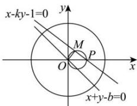

> [!faq]- 全练一本通解析
> **【解析】**
> 解析: 直线 x-ky-1=0 过定点 $P(1,0)$ ,
> 因为 M 是弦的中点，
> 所以 $\overrightarrow{OM}\cdot\overrightarrow{MP}=0$ 故 M 的轨迹方程为： $\left(x_{0}-\frac{1}{2}\right)^{2}+y_{0}^{2}=\frac{1}{4}(x_{0}\neq0)$ 设 $x_{0} + y_{0} = b$ ，即 $x_{0} + y_{0} - b = 0$ 即 $(x_{0},y_{0})$ 是直线 $x+y-b=0$ 与圆 $\left(x-\frac{1}{2}\right)^{2}+y^{2}=\frac{1}{4}(x\neq0)$ 的公共点，
> 由直线与圆的位置关系可得， $\frac{\left|\frac{1}{2}-b\right|}{\sqrt{2}}\leq\frac{1}{2}$ ，解得 $\frac{-\sqrt{2}+1}{2}\leq b\leq\frac{\sqrt{2}+1}{2}$ 所以 $x_{0} + y_{0}$ 的最大值为 $\frac{\sqrt{2} + 1}{2}$ . 故选:C.
> 
