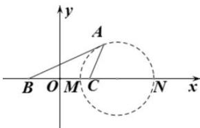

> [!faq]- 全练一本通解析
> **【答案】** C
>
> **【解析】**
> 解析:以 BC 的中点 O 为坐标原点，BC 所在直线为 x 轴建立如图所示的平面直角坐标系，
> 则 $B(-1,0)$ ， $C(1,0)$ . 设点 $A(x,y)(y \neq 0)$ ，由 $\left|AB\right| = \sqrt{2}\left|AC\right|$ ，
> 可得 $(x+1)^{2} + y^{2} = 2\left[(x-1)^{2} + y^{2}\right]$ ，化简得 $(x-3)^{2} + y^{2} = (2\sqrt{2})^{2}(y \neq 0)$ ，
> 故点 A 的轨迹为圆（不包含与 x 轴的交点），记圆 $(x-3)^{2} + y^{2} = (2\sqrt{2})^{2}$ 与 x 轴的交点分别为 M，N （M 在 N 的左侧）则 $\left|MB\right| = 4 - 2\sqrt{2}$ ， $\left|NB\right| = 4 + 2\sqrt{2}$ ，
> 所以 $\overrightarrow{BC}\cdot\overrightarrow{BA}=\left|\overrightarrow{BC}\right|\cdot\left|\overrightarrow{BA}\right|\cdot\cos\angle ABC>\left|\overrightarrow{BC}\right|\cdot\left|\overrightarrow{BM}\right|=8-4\sqrt{2}$ ， $\overrightarrow{BC}\cdot\overrightarrow{BA}<\left|\overrightarrow{BC}\right|\cdot\left|\overrightarrow{BN}\right|=8+4\sqrt{2}$
> 故选：C.
> 
