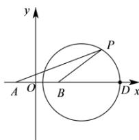

> [!faq]- 全练一本通解析
> **【解析】**
> $12\pi;24+16\sqrt{3}$ 解析:以经过 A, B 的直线为 x 轴, 线段 AB 的垂直平分线为 y 轴, 建立直角坐标系, 如图,
> 
> 则 $A(-2,0)$ ， $B(2,0)$ ，设 $P(x,y)$ ， $\frac{|PA|}{|PB|} = \sqrt{3}$ ， $\therefore \frac{\sqrt{(x + 2)^2 + y^2}}{\sqrt{(x - 2)^2 + y^2}} = \sqrt{3}$ ，得： $x^2 + y^2 - 8x + 4 = 0 \Rightarrow (x - 4)^2 + y^2 = 12$ ，点 $P$ 的轨迹为圆（如图），其面积为 $12\pi$ 。 $\overrightarrow{PA} \cdot \overrightarrow{PB} = x^2 - 4 + y^2 = |OP|^2 - 4$ ，如图当 $P$ 位于点 $D$ 时， $|OP|^2$ 最大， $|OP|^2$ 最大值为 $(4 + 2\sqrt{3})^2 = 28 + 16\sqrt{3}$ ，故 $\overrightarrow{PA} \cdot \overrightarrow{PB}$ 最大值是 $24 + 16\sqrt{3}$ 。故答案为： $12\pi$ ； $24 + 16\sqrt{3}$ 。
