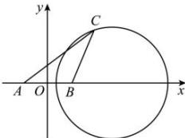

> [!faq]- 全练一本通解析
> **【解析】**
> $8\sqrt{2}$
> 解析:如图,以 AB 的中点为原点, AB 为 x 轴, AB 的中垂线为 y 轴, 建立平面直角坐标系, 如图所示,
> 
> 则 $A(-2,0)$ ， $B(2,0)$ ，设 $C(x,y)$ ，由 $AC = \sqrt{2} BC$ ，得 $\sqrt{(x + 2)^2 + y^2} = \sqrt{2} \cdot \sqrt{(x - 2)^2 + y^2}$ ，化简可得 $(x - 6)^2 + y^2 = 32$ ，则点 $C$ 的轨迹是以 (6,0) 为圆心，半径 $r = 4\sqrt{2}$ 的圆，且去掉点 $(6 + 4\sqrt{2}, 0)$ 和 $(6 - 4\sqrt{2}, 0)$ ；所以 $\triangle ABC$ 的面积的最大值为 $\frac{1}{2} \times |AB| \times r = \frac{1}{2} \times 4 \times 4\sqrt{2} = 8\sqrt{2}$ ，故答案为： $8\sqrt{2}$ 。
