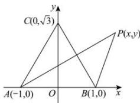

> [!faq]- 全练一本通解析
> **【解析】**
> $[2\sqrt{3}-2\sqrt{2},2\sqrt{3}+2\sqrt{2}]$
> 解析:以线段 AB 的中点 O 为坐标原点, AB 所在直线为 x 轴, AB 的垂直平分线为 y 轴, 建立如图所示的平面直角坐标系 xOy,
> 
> 则点 A、B、C 的坐标分别为 $(-1,0)$ 、 $(1,0)$ 、 $(0,\sqrt{3})$ ，
> 设点 P 的坐标为 $(x,y)$ ,
> 因为 $\left|\overrightarrow{PA}\right|=\sqrt{2}\left|\overrightarrow{PB}\right|$ ，所以 $\left|\overrightarrow{PA}\right|^{2}=2\left|\overrightarrow{PB}\right|^{2}$ 所以 $(x+1)^{2}+y^{2}=2[(x-1)^{2}+y^{2}]$ ，即 $(x-3)^{2}+y^{2}=8$ ，
> 点 P 在以 M(3,0) 为圆心， $2\sqrt{2}$ 为半径的圆上，
> 则 $\left|\overrightarrow{PC}\right|_{\max}=\left|CM\right|+2\sqrt{2}=\sqrt{9+3}+2\sqrt{2}=2\sqrt{2}+2\sqrt{3}$ $\left|\overrightarrow{PC}\right|_{\min}=\left|CM\right|-2\sqrt{2}=2\sqrt{3}-2\sqrt{2}$ 故 $|\overrightarrow{PC}|$ 的取值范围是 $[2\sqrt{3}-2\sqrt{2},2\sqrt{3}+2\sqrt{2}]$ .
> 故答案为： $[2\sqrt{3}-2\sqrt{2},2\sqrt{3}+2\sqrt{2}]$ .
