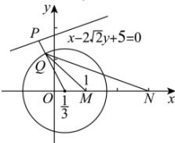

> [!faq]- 全练一本通解析
> **【答案】** $\frac{4}{9}$
>
> **【解析】**
> 设 $Q(x,y)$ ,由 $\frac{|MQ|}{|NQ|}=\frac{1}{2}$ 得 $\frac{|MQ|^{2}}{|NQ|^{2}}=\frac{1}{4},4|MQ|^{2}|=|NQ|^{2}$ ,
> 即 $4\left[(x-1)^{2}+y^{2}\right]=(x-3)^{2}+y^{2}$ ,即 $x^{2}-\frac{2}{3}x+y^{2}=\frac{5}{3}$ ,
> 也即 $\left(x-\frac{1}{3}\right)^{2}+y^{2}=\frac{16}{9}$ ,所以 $Q$ 点的轨迹是以 $\left(\frac{1}{3},0\right)$ 为圆心,半径为 $\frac{4}{3}$ 的圆,
> 所以点 $P$ 和点 $Q$ 距离的最小值为 $\frac{\left|\frac{1}{3}-2\sqrt{2}\times0+5\right|}{\sqrt{1+\left(-2\sqrt{2}\right)^{2}}}-\frac{4}{3}=\frac{4}{9}$ .
> $$
> \text {习:} \frac {4}{9}
> $$
> 
