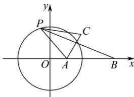

> [!faq]- 全练一本通解析
> **【答案】** $4\sqrt{2}$
>
> **【解析】**
> 由题意知 $A(2,0)$ 、 $B(8,0)$ 、 $C(4,2)$ ，且动点 P 满足 $\frac{\left|PA\right|}{\left|PB\right|}=\frac{1}{2}$ 设 $P(x,y)$ ，则 $\frac{\sqrt{(x-2)^{2}+(y-0)^{2}}}{\sqrt{(x-8)^{2}+(y-0)^{2}}}=\frac{1}{2}$ 整理得 $x^{2} + y^{2} = 16$ ，即 P 点在圆 $x^{2} + y^{2} = 16$ 上运动，A 点在圆内，C 在该圆外；
> 
> 由于 $2|PC| + |PB| = 2|PC| + 2|PA| = 2(|PC| + |PA|)$ 则当 $A, P, C$ 三点共线，即 $P$ 在线段 $AC$ 上时， $2|PC| + |PB|$ 最小，最小值为 $2|AC| = 2\sqrt{(4 - 2)^2 + (2 - 0)^2} = 4\sqrt{2}$ ，故答案为： $4\sqrt{2}$
