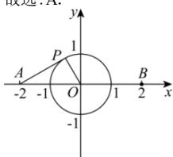

> [!faq]- 全练一本通解析
> **【答案】** A
>
> **【解析】**
> 解析:如图,以线段 AB 所在的直线为 x 轴,线段 AB 的中垂线为 y 轴,建立平面直角坐标系 xOy,
> 设 $P(x,y)$ ，因为 $\left|AB\right|=4$ ，不妨设 $A(-2,0), B(2,0)$ ，
> 由 $\left|PA\right|^{2}+\left|PB\right|^{2}=10$ ，得 $(x+2)^{2}+y^{2}+(x-2)^{2}+y^{2}=10$ ，
> 化简得 $x^{2} + y^{2} = 1$ ，即点 P 的轨迹为以 O 为圆心，1 为半径的圆，
> 当 PA 与圆 O 相切时， $\angle PAB$ 取得最大值，此时 $OP \perp PA$ .
> 因为 $\left|OP\right|=1,\left|OA\right|=2$ ,所以 $\sin\angle PAB=\frac{1}{2}$ ,且 $\angle PAB$ 为锐角，
> 故 $\angle PAB$ 的最大值为 $\frac{\pi}{6}$ .
> 故选:A.
> 
